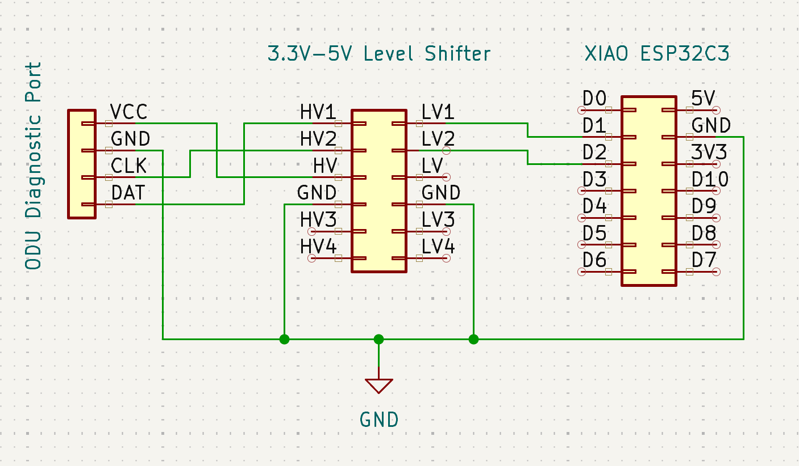

# midea-telemetry

Arduino firmware for capturing telemetry from the diagnostic port on Midea mini-splits, located on the outdoor inverter board. Midea sells a handheld inverter tester that plugs into this port. This project reproduces that tester with a cheap ESP32S3 microcontroller, so you can log the same data yourself and explore the inner workings of your unit.

The prototype has 3 capabilities:
- Emulate the inverter tester to capture data from the ODU (primary use case)
- Sniff the communication between the inverter tester and ODU (used during protocol reverse engineering)
- Emulate the ODU to send custom responses to the inverter tester (used to track down the meaning and encoding of individual bytes)

Example: The prototype connected to the inverter tester and diagnostic bus to sniff the communication:


> ⚠️ **Safety.** The outdoor unit runs on mains voltage and can retain a dangerous charge after being unplugged. Only plug a connector into the diagnostic port if you know what you are doing. You are responsible for your own hardware and safety.

## The protocol

I reverse-engineered the communication between the inverter tester and the diagnostic port and wrote it up on Medium: [Reverse Engineering Midea's ODU Diagnostic Port](https://medium.com/@florian.mckee/reverse-engineering-mideas-odu-diagnostic-port-af603e159053). The sketches in this repository are based on those findings. Start there if you want to understand the protocol.

## Schematics


The only thing you need to connect an ESP32 to the diagnostic port is a level shifter:



BOM:
- [3.3V-5V Level Shifter](https://www.amazon.com/dp/B07F7W91LC)
- [XIAO ESP32S3](https://www.amazon.com/dp/B0BYSB66S5)

## Sketches

### `inverter-tester-emulator.ino`

Source: [inverter-tester-emulator.ino](arduino/inverter-tester-emulator/inverter-tester-emulator.ino)

Emulates Midea's inverter tester: it **drives** the bus, sending diagnostic requests and logging the ODU's responses. This lets you capture telemetry **without owning the inverter tester**.

The set of request messages to send is defined in the `messages` table in `loop()`. Edit it to send different requests. Each request/response pair is printed to serial:

```
req=0xAA000000000000000056, res=0xFFFFFFFFFFFFFFFFFFFF, status=NO_RESPONSE_FROM_ODU
req=0xAA000000000000000056, res=0xFFFFFFFFFFFFFFFFFFFF, status=NO_RESPONSE_FROM_ODU
req=0xAA000000000000000056, res=0xFFFFFFFFFFFFFFFFFFFF, status=NO_RESPONSE_FROM_ODU
req=0xAA000000000000000056, res=0x55006D457671401F03B0, status=OK
req=0xAA010000000000000055, res=0x550128A7B3E8006002DE, status=OK
req=0xAA0200000000FF000055, res=0x55022C2A000000000152, status=OK
req=0xAA030000000000000053, res=0x55030000160EA20000E2, status=OK
req=0xAA000000000000000056, res=0x550400000000002C2C4F, status=OK
req=0xAA010000000000000055, res=0x55054F00000000000057, status=OK
req=0xAA0200000000FF000055, res=0x550600000000000000A5, status=OK
req=0xAA030000000000000053, res=0x55006D457671401F03B0, status=OK
req=0xAA000000000000000056, res=0x550128AAB3EC006002D7, status=OK
req=0xAA010000000000000055, res=0x55022C2B000000000151, status=OK
req=0xAA0200000000FF000055, res=0x55030000160EA70000DD, status=OK
req=0xAA030000000000000053, res=0x550400000000002C2C4F, status=OK
...
req=0xAA010000000000000055, res=0x550128A0B3EC006002E1, status=OK
req=0xAA0200000000FF000055, res=0x55022C2B000000000151, status=OK
req=0xAA030000000000000053, res=0x55030000160BA00000E3, status=CHECKSUM_ERROR
...
```

### `bus-sniffer.ino`

Source: [bus-sniffer.ino](arduino/bus-sniffer/bus-sniffer.ino)

Passively **listens** on the bus while the **inverter tester is plugged in**, decoding the request/response cycles between the tester and the ODU. Useful for reverse-engineering the protocol. Each request/response pair is printed to serial:

```
req=0xAA010000000000000055, res=0xA00A0000000000000060, status=CHECKSUM_ERROR
req=0xAA010000000000000055, res=0xFFFFFFFFFFFFFFFFFFFF, status=NO_RESPONSE_FROM_ODU
req=0xAA000000000000000056, res=0xFFFFFFFFFFFFFFFFFFFF, status=NO_RESPONSE_FROM_ODU
req=0xAA000000000000000056, res=0x55030000160EAB0000D9, status=OK
req=0xAA010000000000000055, res=0x55040000000000292955, status=OK
req=0xAA0200000000FF000055, res=0x55006C467671431F03AD, status=OK
req=0xAA030000000000000053, res=0x550127AEB3E7006002D9, status=OK
req=                      , res=                      , status=INCOMPLETE
req=0xAA030000000000000053, res=0x55022928000000000157, status=OK
req=0xAA010000000000000055, res=0x55030000160EAA0000DA, status=OK
req=0xAA0200000000FF000055, res=0x55040000000000292955, status=OK
req=0xAA030000000000000053, res=0x55056100000000000045, status=OK
req=0xAA000000000000000056, res=0x550600000000000000A5, status=OK
req=0xAA010000000000000055, res=0x55006C467671431F03AD, status=OK
req=0xAA0200000000FF000055, res=0x550127ABB3E7006002DC, status=OK

...
```

Note: I initially used a ESP32C3 and I regularly encountered messages that don't decode fully — some bits are lost when loop() isn't called fast enough. There are ways around this, but I prefer to keep the sketch simple, and I can still capture enough data for analysis (even if it takes a couple of tries).

When a request or response fails to decode, you'll see a line like:
```
req=                      , res=                      , status=INCOMPLETE          
```

Switching to a ESP32S3 has resolved those issues for me.

### `odu-emulator.ino`

Source: [odu-emulator.ino](arduino/odu-emulator/odu-emulator.ino)

Emulates the ODU. You can use it to send custom responses to the inverter tester to identify the meaning and encoding of indivudal response bytes.

## Building & flashing

1. Install the [Arduino IDE](https://www.arduino.cc/en/software) and select your board (e.g.,  ESP32S3) via the Boards Manager.
2. Open the sketch you want.
3. Select your board and serial port, then upload.
4. Open the **Serial Monitor** to view the captured telemetry.

## Status

Early / experimental. The protocol is still being reverse-engineered, and the meaning of individual bytes is not yet fully documented.
