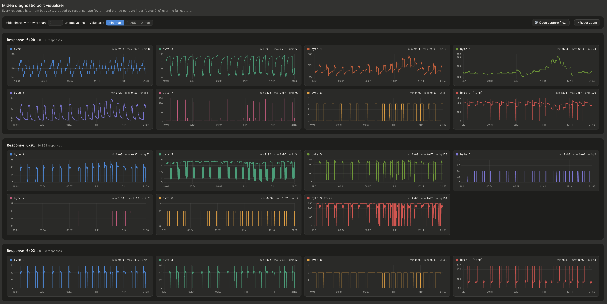

# midea-telemetry

Arduino firmware for capturing telemetry from the diagnostic port on Midea mini-splits, located on the outdoor inverter board. Midea sells a handheld inverter tester that plugs into this port. This project reproduces that tester with a cheap ESP32S3 microcontroller, so you can log the same data yourself and explore the inner workings of your unit.

The prototype has 3 capabilities:
- **Emulate the inverter tester** to capture data from the ODU (primary use case)
- **Sniff the communication** between the inverter tester and ODU (used during protocol reverse engineering)
- **Emulate the ODU** to send custom responses to the inverter tester (used to track down the meaning and encoding of individual bytes)

Example: The prototype connected to the inverter tester and diagnostic bus to sniff the communication:


Initial tests indicate that this is a robust way to extract telemetry data from my mini-splits:



> ⚠️ **Safety.** The outdoor unit runs on mains voltage and can retain a dangerous charge after being unplugged. Only plug a connector into the diagnostic port if you know what you are doing. You are responsible for your own hardware and safety.

## The protocol

I reverse-engineered the communication between the inverter tester and the diagnostic port and wrote it up on Medium: [Reverse Engineering Midea's ODU Diagnostic Port](https://medium.com/@florian.mckee/reverse-engineering-mideas-odu-diagnostic-port-af603e159053). The sketches in this repository are based on those findings. Start there if you want to understand the protocol.

In short: the bus is a two-wire (clock + data) 5V bus. The tester drives the clock in both directions and exchanges 80-bit frames with the ODU, LSB-first. A request starts with `0xAA`, a response with `0x55`; the second byte selects one of seven response types, and the last byte is a checksum that makes all ten bytes sum to zero modulo 256.

## Hardware

The only thing you need to connect an ESP32 to the diagnostic port is a level shifter:


BOM:
- [3.3V-5V Level Shifter](https://www.amazon.com/dp/B07F7W91LC)
- [XIAO ESP32S3](https://www.amazon.com/dp/B0BYSB66S5)

All sketches expect the clock line on **D2** and the data line on **D1** (see the `PIN_CLK` / `PIN_DAT` defines at the top of each sketch). The KiCad project for the schematic lives in [schematics/](schematics/).

The assembled prototype:


## Sketches

| Sketch | Role on the bus | Use it to... |
|---|---|---|
| [inverter-tester-emulator](arduino/inverter-tester-emulator/inverter-tester-emulator.ino) | drives the bus like the tester | capture telemetry without owning the tester |
| [bus-sniffer](arduino/bus-sniffer/bus-sniffer.ino) | passive listener | reverse-engineer tester ↔ ODU traffic |
| [odu-emulator](arduino/odu-emulator/odu-emulator.ino) | answers like the ODU | map response bytes to tester display fields |

### `inverter-tester-emulator.ino`

Emulates Midea's inverter tester: it **drives** the bus, sending diagnostic requests and logging the ODU's responses. This lets you capture telemetry **without owning the inverter tester**.

The set of request messages to send is defined in the `requests` table in `loop()`. Edit it to send different requests. Each request/response pair is printed to serial:

```
req=0xAA000000000000000056, res=0xFFFFFFFFFFFFFFFFFFFF, status=NO_RESPONSE_FROM_ODU
req=0xAA000000000000000056, res=0xFFFFFFFFFFFFFFFFFFFF, status=NO_RESPONSE_FROM_ODU
req=0xAA000000000000000056, res=0x55006D457671401F03B0, status=OK
req=0xAA010000000000000055, res=0x550128A7B3E8006002DE, status=OK
req=0xAA0200000000FF000055, res=0x55022C2A000000000152, status=OK
req=0xAA030000000000000053, res=0x55030000160EA20000E2, status=OK
req=0xAA000000000000000056, res=0x550400000000002C2C4F, status=OK
req=0xAA010000000000000055, res=0x55054F00000000000057, status=OK
req=0xAA0200000000FF000055, res=0x550600000000000000A5, status=OK
...
req=0xAA030000000000000053, res=0x55030000160BA00000E3, status=CHECKSUM_ERROR
...
```

### `bus-sniffer.ino`

Passively **listens** on the bus while the **inverter tester is plugged in**, decoding the request/response cycles between the tester and the ODU. Useful for reverse-engineering the protocol. Each request/response pair is printed to serial in the same format as above.

When a request or response fails to decode, you'll see a line like:
```
req=                      , res=                      , status=INCOMPLETE
```

Note: I initially used an ESP32C3 and regularly encountered messages that don't decode fully — some bits are lost when `loop()` isn't called fast enough. There are ways around this, but I prefer to keep the sketch simple, and I can still capture enough data for analysis (even if it takes a couple of tries). Switching to an ESP32S3 has resolved those issues for me.

### `odu-emulator.ino`

Emulates the **ODU**: it waits for the inverter tester to clock out a request, then answers with a configurable response frame. By changing individual response bytes and watching what changes on the tester's display, you can map each byte to a display field and work out the conversion between raw byte and displayed value.

The seven response payloads (bytes 1–9 of each frame) are defined in the `responsePayloads` table at the top of the sketch. The checksum (byte 10) is always generated automatically, so any payload byte can be changed freely.

Payloads can also be changed **at runtime over USB serial** — no reflashing between experiments:

```
show                     print all response frames (checksum included)
set <slot> <18 hex>      replace bytes 1-9 of a frame, e.g. set 2 55022C2A0000000001
poke <slot> <byte> <hex> change a single byte (1-9),  e.g. poke 2 3 2B
```

A typical session — bump one byte, watch the tester display:

```
2: 0x55022C2A000000000152
> poke 2 3 2B
2: 0x55022B2A000000000153
```

Tip: the two emulator sketches are exact counterparts, so you can bench-test them against each other with two boards (clock-to-clock, data-to-data, ground-to-ground) before connecting real hardware — no external pull-ups needed.

## Dashboard

[dashboard/index.html](dashboard/index.html) is a self-contained, browser-based visualizer for captured telemetry — no build step, just open it in a browser. Pick a capture file and it plots every response byte (bytes 2–9) over time, grouped by response type (byte 1), with synced zoom/pan across charts. Bytes that never change are hidden automatically.

It expects capture files with one `req=..., res=..., status=...` line per cycle, prefixed with a Unix timestamp — see [data/bus.txt](data/bus.txt) for an example. A capture like that can be recorded straight from the serial port:

```bash
cat /dev/ttyACM0 | while IFS= read -r line; do echo "$(date +%s) $line"; done >> data/$(date +%F).bus.txt
```

(`download.sh` is the helper I use to pull captures from my own logging host — adapt it to your setup or ignore it.)

## Building & flashing

1. Install the [Arduino IDE](https://www.arduino.cc/en/software) and the **esp32 by Espressif Systems** boards package (3.x) via the Boards Manager.
2. Open the sketch you want.
3. Select your board (e.g., XIAO_ESP32S3) and serial port, then upload.
4. Open the **Serial Monitor** to view the captured telemetry. The sketches print over the native USB port (`HWCDCSerial`), so any baud rate works.

## Status

Early / experimental. The protocol is still being reverse-engineered, and the meaning of individual bytes is not yet fully documented.
